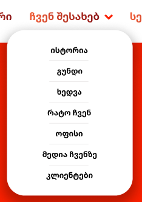
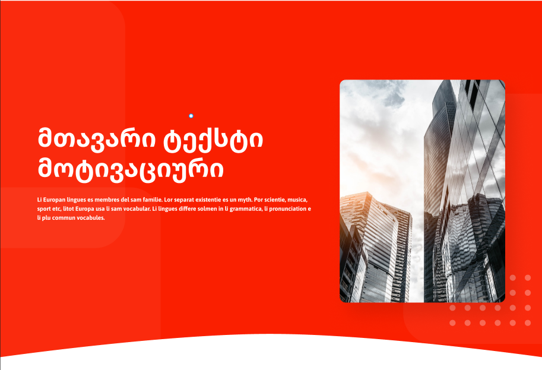
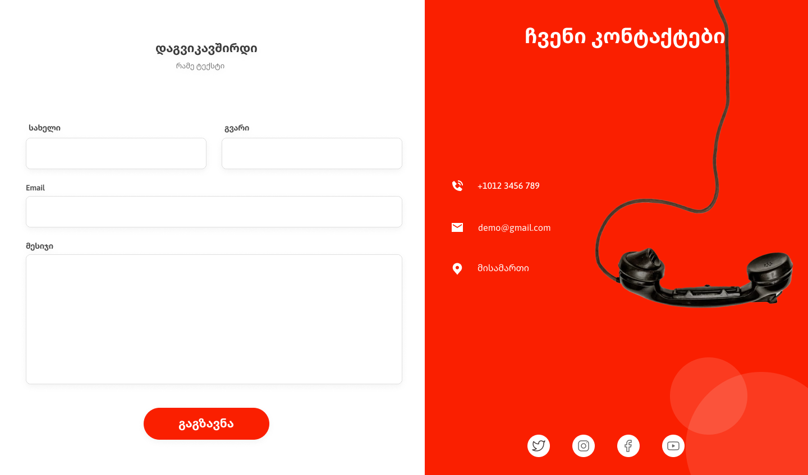
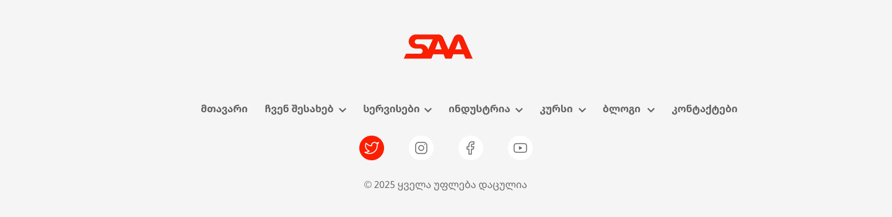

# **React Component Architecture**

This document outlines the architectural structure of our React components, ensuring modularity, reusability, and maintainability. Each component serves a distinct purpose and follows best practices for scalability.  

---

## **Navbar**  

### **Logo**  
- **`Logo`** – Displays the brand logo as an image file (`.png`, `.jpeg`, `.svg`, etc.).  

  

### **Navigation**  
- **`NavButton`** – A navigation button that:
  - Contains the page name it links to.  
  - Optionally includes an accordion dropdown for in-page navigation.  

  

---

## **Hero Section**  

### **Main Hero Section**  
- **`MainHero`** – The primary hero section displayed on the homepage.  

  

- **`IndustryHero`** – A variation of the hero section, designed for industry-specific pages.  

  

---

## **Carousel**  

### **Carousel**  
- **`Carousel`** – The parent component that manages transitions and hosts all child carousel items.  

  

- **`CarouselItem`** – Represents an individual slide within the carousel, accepting the following props:  
  - `icon` – An icon representing the item.  
  - `title` – A headline for the item.  
  - `text` – A brief description.  

---

## **Cards**  

### **Team Member Card**  
- **`TeamMember`** – A card component used to display details about a team member. Accepts the following props:  
  - `pfp` – Profile picture.  
  - `memberName` – Name of the team member.  
  - `position` – The team member's role.  

  

### **Info Cards**  
- **`InfoCard`** – A compact information card used for quick insights. Accepts:  
  - `icon` – A relevant icon.  
  - `header` / `title` – A brief header for the card.  
  - `text` – A short descriptive text.  

  

---

## **Contact Form**  

### **Contact Form**  
- **`ContactForm`** – Handles user inquiries and email submissions from the website.  

  

---

## **Footer**  

### **Footer Structure**  
The footer is designed for branding, navigation, and external links.  

1. **`Footer`** – The root component that organizes all footer sections.  

2. **`FooterLogo`** – Displays the "SAA" logo prominently at the top.  

3. **`FooterNav`** – Contains the footer navigation links.  
   - **`FooterNavItem`** – Represents an individual navigation link.  

4. **`SocialLinks`** – Hosts external social media links.  
   - **`SocialLink`** – Represents an individual social media icon with a link.  

5. **`FooterCopyright`** – Displays legal and copyright information.  

  

---

## **Final Notes**  
This component structure is designed for scalability, readability, and maintainability. Each component follows the **Single Responsibility Principle (SRP)** and adheres to best practices for clean, modular React development.  

For any modifications or extensions, follow the established patterns to ensure consistency.